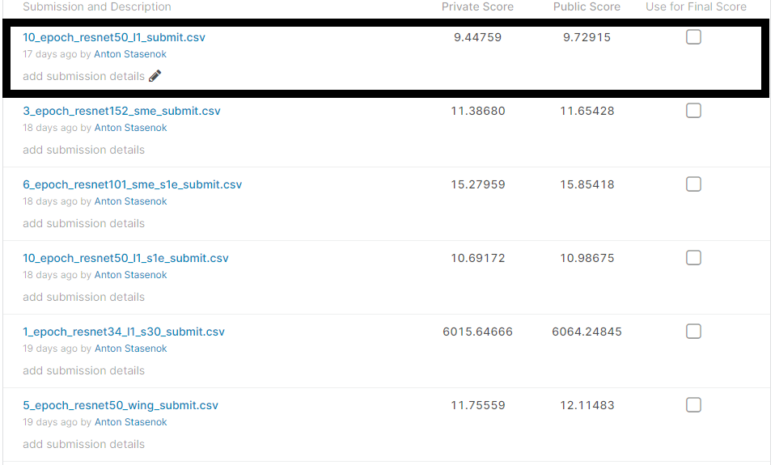

# Домашнее задание № 1 по CV MADE: Thousand Facial Landmarks Competition

В этом репозитории вы найдете код решения Kaggle InClass соревнования "Thousand Facial Landmarks", проходившего рамках курса MADE Computer Vision.

Задачей соревнования было предсказать координаты 971 точек лица на основе датасета из 393 930 фотографий.

В данном соревновании я занял 44 место.

Для решения задания использовал мощности Amazon Web Services любезно предоставленные организаторами [made](https://data.mail.ru/). За что им отдельное спасибо. 

# Описание решения

0. Скопировал нейобходимые куски кода из hack_train.py и hack_utils.py и далее использовал их за основу
1. Были подготовлены функции для обработки изображений
2. Далее были подготовлены функции для обучения, валидации и предсказания результатов
3. Читаем и трансформируем данные для обучения и валидации. Размер батча - 256
4. Определяем модель (предобученная resnet50), функцию потерь, метод оптимизации. В качестве функции потерь лучше всего себя показала smooth_l1_loss, также пробовал WingLoss
5. Добавляем дополнительный линейный слой над предобученной моделью
6. Обучение и валидация модели
7. Генерируем предсказание для загрузки на kaggle

Скриншот сабмитов:
